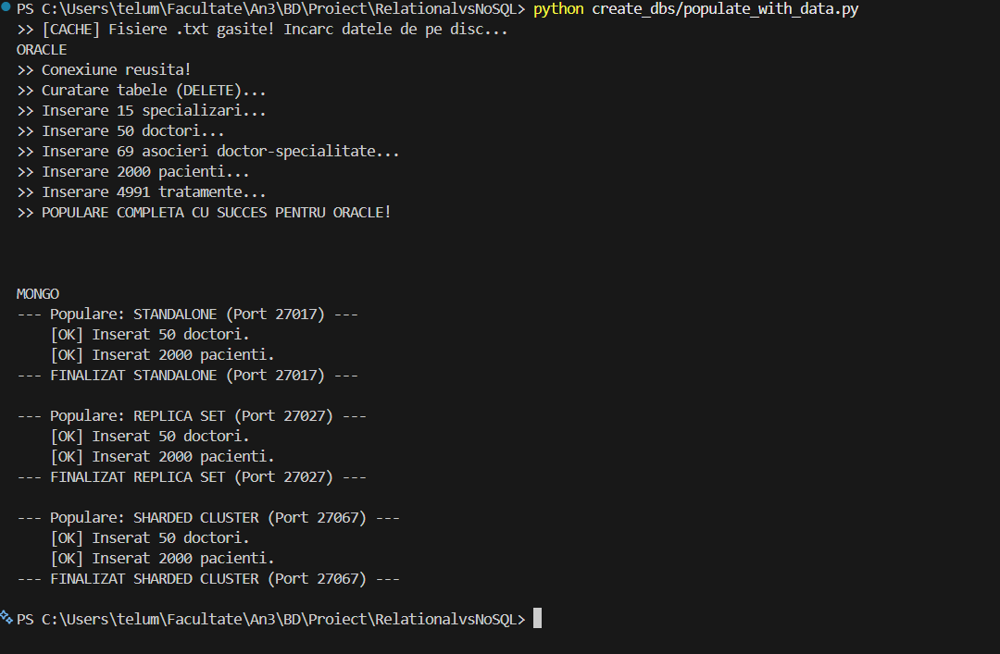
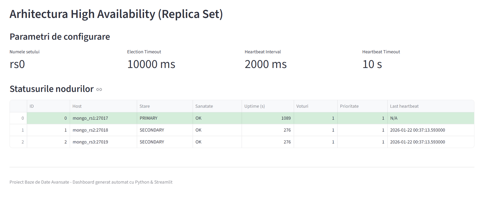
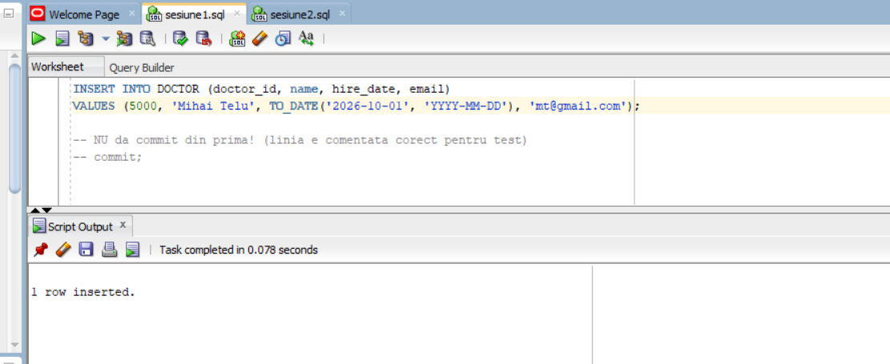
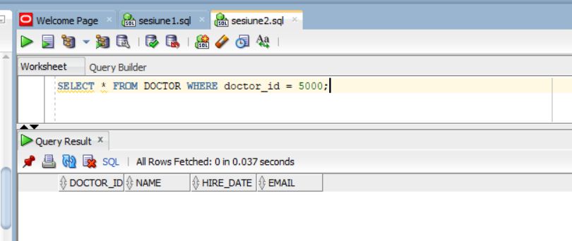
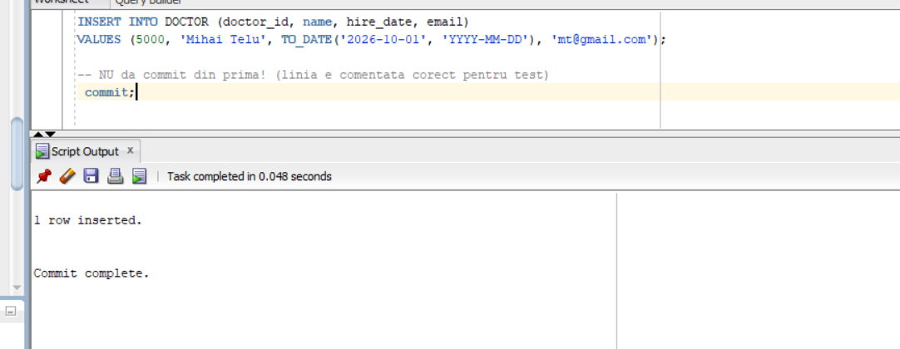
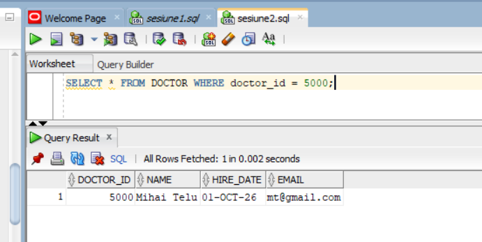
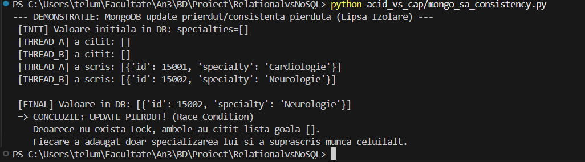
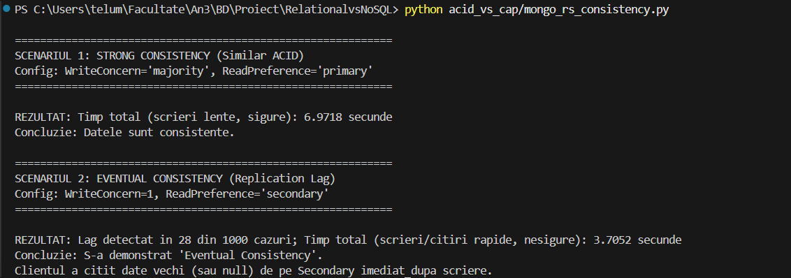
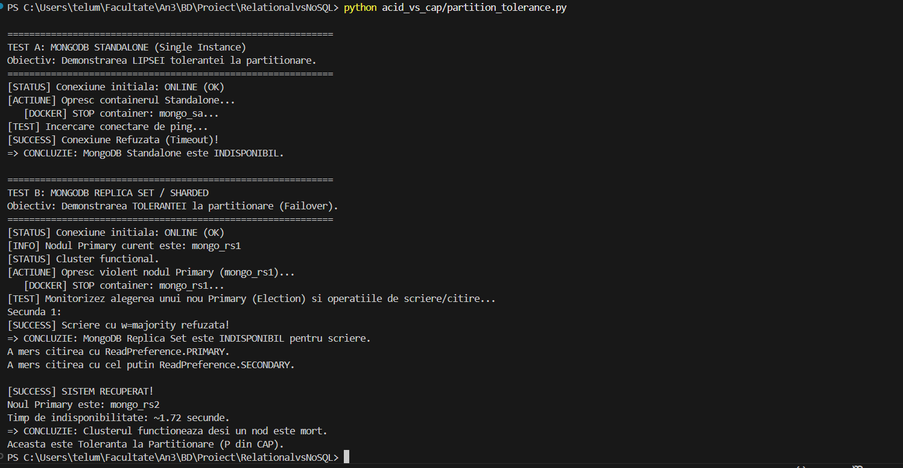
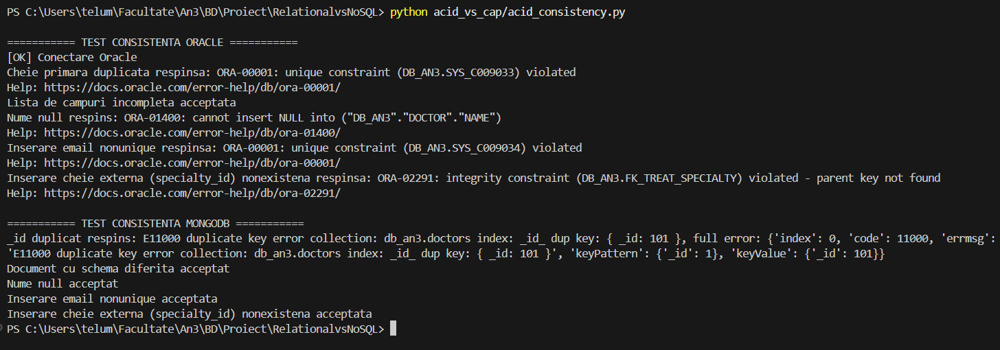

# Relational vs NoSQL
# Team: Telu Mihai-Sebastian

## Decizii arhitecturale și de modelare

Atunci când vorbim despre baze de date relaționale versus NoSQL, discutăm mai mult sau mai puțin despre „single database” versus „sisteme distribuite”. În practică, majoritatea SGBD-urilor relaționale sunt optimizate pentru tranzacții ACID, scalând vertical (server unic cu multă memorie), în timp ce multe sisteme NoSQL sunt proiectate nativ pentru distribuție și scalare orizontală, funcționând sub constrângerile teoremei CAP.

În cadrul proiectului, am ales să folosesc Oracle Database 19c ca reprezentant pentru SQL, deoarece este un SGBD relațional clasic care respectă cu strictețe proprietățile ACID (spre deosebire de, de exemplu, MyISAM din MySQL, care nu suportă tranzacții și scrie datele direct pe disc, fără garanții de atomicitate și izolare). Experiența anterioară cu Oracle și ușurința marcării tranzacțiilor prin blocuri SQL/PLSQL au reprezentat motive suplimentare pentru această alegere. Am utilizat varianta 19c instalată direct pe Windows 11 Home, deoarece rulează o singură instanță, fără partitionare, reprezentând un server unic. Resursele alocate (4 GB RAM) sunt suficiente pentru o bază de test, iar folosirea de containere sau mașini virtuale ar fi fost mai costisitoare și mai dificil de gestionat pentru acest scop.

Pentru componenta NoSQL, am ales MongoDB, un SGBD document-oriented matur, care stochează date în documente JSON și oferă suport nativ pentru sisteme distribuite. MongoDB este rulat în containere Docker, ceea ce permite simularea unui mediu distribuit prin configurarea de replica set-uri și sharding. Acest lucru facilitează testarea scenariilor de cădere a nodurilor (node failure), procesele de election și mecanismele de failover, toate fiind componente fundamentale și implicite ale arhitecturii MongoDB, inca un motiv in plus pentru alegerea acestui SGBD.
În cadrul experimentului, sunt analizate trei configurații MongoDB: o instanță Standalone, un Replica Set și un Sharded Cluster, toate utilizând același set de date. Această abordare permite evidențierea diferențelor de comportament în ceea ce privește consistența, disponibilitatea și toleranța la partiționare, precum și compararea directă a compromisurilor dintre modelul ACID (specific sistemelor relaționale) și modelul CAP (specific sistemelor distribuite).

Datele utilizate în experiment reprezintă o bază de date simplificată pentru un spital, adaptată pentru a putea fi gestionată eficient într-un proiect academic. Baza de date conține informații despre medici, specializări, pacienți și tratamente. În funcție de tipul SGBD-ului utilizat, relațiile dintre aceste entități sunt modelate diferit. Pentru a permite o comparație corectă a performanțelor, același volum de date este utilizat pentru ambele sisteme, datele fiind generate cu ajutorul unui script Python care folosește biblioteca Faker pentru a crea date sintetice realiste.

---

## Modelarea pentru Oracle Database

### Diagrama entitate-relație


### Diagrama conceptuală


Modelul relațional este normalizat până la Forma Normală 3 (FN3). Atributele sunt atomice (FN1), fiecare atribut non-cheie depinde complet de cheia primară (FN2), nu doar de o parte, iar dependențele tranzitive sunt eliminate (FN3), adică fiecare atribut non-cheie depinde doar de cheia primară. Entitatea Treatment ar fi putut fi modelată ca un tabel asociativ rezultat dintr-o relație de tip 3, însă pentru simplitatea experimentului a fost tratată ca o entitate separată.

### Crearea și popularea bazei de date
Oracle Database 19c a fost instalată local folosind distribuția oficială:
https://www.oracle.com/database/technologies/oracle19c-windows-downloads.html

După instalarea Oracle Database și a clientului grafic Oracle SQL Developer, schema relațională este creată folosind scriptul SQL din fișierul create_dbs/relational_schema.sql. Datele sunt populate automat cu ajutorul unui script Python (create_dbs/populate_with_data.py), care generează date sintetice realiste (cu faker ([2](#ref2))) și le inserează în tabele prin intermediul bibliotecii oficiale oracledb([1](#ref1)).

Pașii urmați sunt următorii:
1. Conectarea ca administrator la baza de date și crearea utilizatorului dedicat aplicației:
```sql
-- Crearea utilizatorului dorit
CREATE USER db_an3 IDENTIFIED BY parola123;

-- Acordarea drepturilor necesare
GRANT CONNECT, RESOURCE, UNLIMITED TABLESPACE TO db_an3;
```


2. Crearea unei noi conexiuni în Oracle SQL Developer folosind utilizatorul definit anterior.


3. Rularea scriptului relational_schema.sql pentru crearea tabelelor și a constrângerilor de integritate.


4. Instalarea driverului Oracle și a bibliotecii faker pentru generarea datelor sintetice:  

```bash
pip install oracledb faker
```

5. Rularea scriptului populate_with_data.py pentru popularea bazei de date cu date sintetice.
Atenție: acest script este rulat o singură dată, MAI JOS, deoarece este utilizat ulterior și pentru popularea bazei de date MongoDB (celor 3), asigurând astfel consistența volumului și structurii datelor între cele două tipuri de SGBD-uri.


---

## Modelarea pentru MongoDB

Pentru componenta NoSQL, am optat pentru o arhitectură denormalizată([4](#ref4)), strategia inversă normalizării. Denormalizarea este o strategie de optimizare care reduce necesitatea operațiunilor de JOIN și complexitatea interogărilor, prin includerea (embedding) datelor direct în documentele părinte. Deși această abordare introduce redundanță și relaxează consistența strictă specifică modelului ACID, ea este potrivită pentru sisteme în care operațiile de citire sunt mult mai frecvente decât cele de scriere.

### Decizii de modelare

#### 1. Embedding (îmbricare)

Unele colecții și relații au fost eliminate prin îmbricare. Astfel, colecția `doctors` conține un array de specializări, iar colecția `patients` conține un array de tratamente.

Justificare: Într-un sistem medical, datele sunt accesate contextual. Profilul unui medic este, de regulă, consultat împreună cu specializările sale, iar fișa unui pacient împreună cu istoricul tratamentelor. O singură operațiune de citire (`find`) poate returna toate informațiile necesare.

#### 2. Extended Reference Pattern([6](#ref6)) și Subset Pattern([5](#ref5))

Ambele se folosesc pentru relații 1-to-many și many-to-many.

Subset Pattern apare ca o soluție atunci când avem date foarte multe care ar putea depăși capacitatea RAM-ului sau când dorim să optimizăm citirile. În cazul nostru, este mult mai eficient să avem două colecții separate (doctors și patients) și să includem în documentele pacienților doar o parte din informațiile despre doctori și doar specializarea corespunzătoare tratamentului respectiv, în loc să îmbricăm întregul document al doctorului, cu toate specializările sale, în fiecare tratament al pacientului.

Extended Reference Pattern ne spune că, în loc să copiem toate atributele unui document referit, putem copia doar o parte din ele, cele mai relevante pentru contextul în care sunt folosite. De asemenea, aceste atribute ar trebui să fie și cele care se schimbă cel mai rar, pentru a minimiza problemele de consistență a datelor și update-urile multiple.

Astfel, pentru a maximiza viteza de citire și ținând cont de cele două pattern-uri, am aplicat o denormalizare parțială. În lista de tratamente a pacientului, am inclus nu doar ID-urile de referință pentru doctor și specialitate (doctor_id, specialty_id), ci și duplicate ale numelor acestora (doctor_name, specialty_name).

Justificare: Această abordare permite afișarea completă a istoricului medical al unui pacient fără a interoga colecția `doctors`, menținând totodată posibilitatea de a corela datele cu entitățile sursă atunci când sunt necesare informații suplimentare.

#### 3. Gestionarea identificatorilor și a constrângerilor

Pentru a asigura trasabilitatea între baza de date relațională și MongoDB, cheile primare din SQL (`doctor_id`, `patient_id`) au fost mapate direct pe câmpul `_id` al documentelor MongoDB. Această abordare păstrează cerința MongoDB de identificator unic și facilitează corelarea datelor între cele două sisteme.

MongoDB nu oferă constrângeri de integritate referențială (Foreign Keys) la nivel de SGBD. Cu toate acestea, constrângeri de tipuri de date și de prezență a câmpurilor pot fi impuse prin mecanisme de validare JSON Schema. În cadrul acestui proiect, validarea relațiilor dintre documente este realizată la nivel de aplicație (scriptul de generare a datelor), pentru a evidenția diferențele față de modelul relațional.

### NoSQL Schema Diagram


### Crearea și popularea bazei de date
Pentru a demonstra diferențele de performanță și arhitectură, folosim Docker pentru a rula trei instanțe diferite de MongoDB simultan([3](#ref3)):
a. Standalone: O instanță simplă (Port 27017).
b. Replica Set: Un cluster cu 3 noduri pentru disponibilitate ridicată (Primary pe Port 27027, 27028 sau 27029).
c. Sharded Cluster: O arhitectură scalabilă cu Router (mongos), Config Server și un Shard (Router pe Port 27067).

Pașii de configurare:
1. Instalarea Docker Desktop de aici https://docs.docker.com/desktop/  și pornirea containerelor folosind fișierul docker-compose.yml din rădăcina proiectului (după ce pornim Docker Desktop):

```bash
docker-compose up -d
```


Cateva informatii despre .yml:
- Folosim versiunea 3.8 a Docker Compose, care suporta functionalitati avansate pentru definirea serviciilor.
- In services, sunt definite trei tipuri de baze MongoDB: standalone, replica set si sharded cluster, fiecare configurat cu porturile necesare.
- Nu folosesc volume mapping pentru persistenta datelor, deoarece scopul este testarea performantei și comportamentului in memorie. Astfel, datele sunt volatile și se pierd la oprirea containerelor.  
- Fiecare baza de date MongoDB este compusa dintr-unul sau mai multe containere (StandAlone: primul, ReplicaSet: urmatoarele trei, Sharded Cluster: restul). 
- Toate serviciile/containerele au un nume sugestiv extern (numele serviciului), au un nume sugestiv intern (numele din retea; DNS intern), folosesc imaginea oficiala MongoDB (mongo:latest) și comunică printr-o rețea Docker dedicată (mongo_net). 
- RepicaSet-ul are trei noduri: mongo-rs1, mongo-rs2 si mongo-rs3, Sharded Cluster-ul are un config server cu 2 noduri (mongo-cfg1/2; in practică sunt cel putin 3), două shard-uri cu cate 3 noduri (mongo-shard11, mongo-shard12, mongo-shard13 și  mongo-shard21, mongo-shard22, mongo-shard23) și un router (mongo-router).
- In "command" suprascriem comanda implicita de start a imaginii MongoDB pentru a specifica parametrii necesari fiecarei configuratii.
La STANDALONE nu apare, căci se folosește configuratia implicită. 
La REPLICA SET, pentru fiecare conatiner, specificam că: este parte dintr-un replica set prin "--replSet", numele replicaset-ului ("rs0"), faptul că va accepta conexiuni de oriunde prin "--bind_ip_all", dar și faptul că procesul porneste pe un port intern al conatinerului, specific pentru MongoDB ("--port", "27017"/"27018"/"27019").
La SHARDED CLUSTER avem mai multe tipuri de containere: config server ("--configsvr"), shard ("--shardsvr") si router ("mongos"). Fiecare tip are parametrii specifici. Serviciile mongo-cfg (cele cu eticheta "--configsvr") fac parte dintr-un replica set dedicat ("--replSet", "cfgrs") pentru stocarea metadatelor cluster-ului, constituind conceptul de **config server**, mongo-shard1x, mongo-shard2x (cele cu eticheta"--shardsvr") fac parte din replica set-uri ("--replSet", "shard1rs"; "--replSet", "shard2rs") pentru stocarea datelor efective,  constituind conceptul de **shard-uri**, iar serviciul mongo-router ("mongos") este punctul de acces pentru aplicații, care directionează cererile către shard-uri, el reprezentand conceptul de **router**. Toate aceste containere (servicii din conatinere) sunt configurate să accepte conexiuni de oriunde prin "--bind_ip_all" si toate procesele MongoDB (din containere) rulează pe portul intern 27017. 
- Prin comanda "--configdb cfgrs/mongo-cfg1:27017,mongo-cfg2:27017", router-ul se conectează la config server-ul care rulează pe portul 27017 și este definit de replica set-ul "cfgrs", pentru a obtine informațiile despre cluster și a direcționa cererile către shard-uri.
- Secțiunea "depends_on:" de la router asigură că acesta pornește doar după ce config server-ul și ambele shard-uri sunt functionale.
- Nu mapăm porturi pentru toate containerele (prin "- ports: port_extern_PC:port_intern_Container" ), caci nu avem nevoie să sțim portul extern (de pe laptop) pentru toate, deoarece nu le accesăm pe toate din exterior.
- Primary-urile (din Replica Set/Shard-uri) nu sunt alese acum, ci ulterior, in urma rularii scriptului de inițializare, care va face election implicit (deci nu e adevărat că primary-ul este mereu nodul care a făcut inițializarea replicaset-ului).
- Dacă pentru router suntem obligați să scriem explicit **mongos** la începutul listei de comenzi, pentru celelalte containere nu este necesar, deoarece imaginea oficiala MongoDB pornește implicit procesul **mongod** (Mongo Daemon) la start.

2. Inițializarea Arhitecturilor: Deoarece containerele pornesc "goale", trebuie să rulăm scriptul de configurare pentru a activa Replica Set-ul și Clusterul Sharded. Se rulează scriptul init_mongo.bat (sau comenzile echivalente în terminal).
```bash
create_dbs/init_mongo.bat
```


Câteva informații despre script:
- Scriptul init_mongo.bat configurează cele trei tipuri de baze MongoDB: Standalone, Replica Set si Sharded Cluster.
- Pentru Standalone, nu este necesară nicio configurare suplimentară, deoarece acesta rulează implicit ca o instanță simplă.
- Pentru Replica Set, scriptul se conectează la nodul mongo-rs1 și rulează comanda rs.initiate() pentru a inițializa replica set-ul "rs0". Apoi are loc procesul de election unde se decide care noduri sunt secundare și care este primary-ul.
- Pentru Sharded Cluster, scriptul se conectează la router (mongo-router) și rulează comenzile necesare pentru a adăuga config server-ele și shard-urile la cluster. De asemenea, setează regulile de sharding pentru baza de date "db_an3", inclusiv setarea dimensiunii chunk-urilor (1MB, de la default 64, pentru a observa sharding-ul) și activarea sharding-ului pe colectia "patients". 
- Shard key-ul ales este _id, cu indexare hashed, pentru a asigura o distribuție uniformă a datelor între shard-uri, chiar dacă se va pierde puțin din performanța interogărilor range queries.
- **Am folosit Gemini ([7](#ref7)) pentru a crea comanda de modificare a dimensiunii chunk-urilor și pentru a seta regulile de sharding corect.**


3. Punerea in fisierul hosts.txt a intrarilor pentru DNS-urile interne ale containerelor lui MongoDB ReplisaSET (numelere serviciilor din docker-compose.yml), pentru a putea fi accesate din Windows (pentru testare manuala ulterioara, daca e nevoie): 127.0.0.1 mongo_rs1 mongo_rs2 mongo_rs3. Avem de nevoie de asta deoarece nu aveam un router asa cum e la Sharded Cluster, iar noi dorim să accesăm intrega colecție, nu doar membrii.


4. Instalarea bibliotecii pymongo pentru interacțiunea cu Python:
```bash
pip install pymongo
```


5. Popularea Unificată - Rularea scriptului populate_with_data.py: 
```bash
python create_dbs/populate_with_data.py
```



Câteva informații despre script:
- Scriptul populate_with_data.py populează toate cele trei instanțe MongoDB (Standalone, Replica Set și Sharded Cluster) cu același set de date utilizat pentru Oracle Database, generate cu ajutorul bibliotecii Faker și care diferă de la generare la generare. Totuși, eu fac persisitente datele, deoarece le păstrez pe primele generate în folderul data_set sub forma de fisiere .txt, iar la generarile următoare încerc sa le iau de acolo, pentru a avea acelasi set de date la fiecare rulare.
- Scriptul curăță mai întâi documentele existente din fiecare instanță pentru a evita duplicarea datelor si apoi inserează documentele generate în colecțiile corespunzătoare.
- Curățarea colecțiilor se face prin apeluri la metoda delete_many({}) pentru fiecare colecție din fiecare instanță MongoDB, asigurându-se că datele vechi sunt eliminate înainte de inserarea noilor date, dar nu dispare configurația de sharding. Pentru Oracle, tabelele sunt golite prin comenzi de DELETE.

6. Oprirea containerelor după terminarea testelor:
```bash
docker-compose down
```


---

## Dashboard pentru distribuție, modelare și arhitectură a datelor
Pentru a vizualiza și compara modelele de date relaționale și NoSQL, am creat un dashboard interactiv folosind Streamlit, folosind **Gemini ([8](#ref8))**, dar și **cursul despre replicare și sharding**. Acesta permite explorarea diagramelor, a deciziilor de modelare și a arhitecturii alese pentru fiecare tip de bază de date.

Pasii pentru rularea dashboard-ului:
1. Instalarea streamlit, pandas (pentru tabele) și plotly (pentru grafice plăcute):
```bash
pip install streamlit pandas plotly
```


2. Rularea aplicației Streamlit folosind fișierul dashboard.py din folderul dashboards:
```bash
streamlit run dashboards/dashboard1.py
```





---
## Diferențe cheie de modelare și arhitectură între SQL și NoSQL (Oracle vs MongoDB)

| Aspect | Oracle Database (Relațional) | MongoDB (NoSQL) |
|------|-----------------------------|-----------------|
| Model de date | Tabular (tabele, rânduri, coloane) | Documente BSON (JSON-like) |
| Schema | Fixă, impusă strict de BD | Flexibilă (schema-less la nivel de engine) |
| Tipuri de date | Strict definite | Slab tipizate (implicit) |
| Chei primare | Obligatorii | Opționale (se pune automat _id, dacă nu se precizează) |
| Chei externe | Suportate nativ (FOREIGN KEY) | Nesuportate nativ |
| Integritate referențială | Garantată de BD | Gestionată la nivel de aplicație (scriptul de insert) |
| Normalizare | Puternic normalizat | De obicei denormalizat |
| Relații între entități | JOIN-uri eficiente | Referințe manuale sau documente embed |
| Scalabilitate | Verticală (scale-up) | Orizontală (scale-out) |
| Replicare | Nativă (Data Guard, RAC) | Nativă (Replica Set) |
| Sharding | Nu este nativ | Nativ |
| Performanță citire | Bună, cu cost JOIN | Foarte bună (document complet) |
| Overhead de stocare | Redus | Mai mare (BSON + metadata) |
| Volum datelor stocate (pentru același set de date inserate) | Date compacte, fără duplicate, fără nume de coloane repetate. Aprox. 0.4MB pentru datele de test | Foarte mare. Date denormalizate (duplicate), cu numele cheilor repetate în fiecare document. |
| Evoluția structurii | Costisitoare (ALTER TABLE) | Foarte ușoară (pur și simplu inserezi documente cu un câmp nou/fără un anumit câmp) |


---


## ACID vs CAP([10](#ref10))
Intai de toate, trebuie sa definim cele doua concepte:
- ACID este un set de proprietăți care garantează că tranzacțiile de baze de date sunt procesate în mod fiabil. ACID este un acronim pentru Atomicitate, Consistență, Izolare și Durabilitate si este specific bazelor de date relaționale. Fiecare literă reprezintă o proprietate esențială a tranzacțiilor:
  - Atomicitate: O tranzacție este o unitate indivizibilă de lucru care fie se finalizează complet, fie nu se finalizează deloc. 
  - Consistență: O tranzacție duce baza de date dintr-o stare validă într-alta stare validă, respectând toate regulile și constrângerile definite.
  - Izolare: Tranzacțiile concurente sunt izolate una de cealaltă, astfel încât rezultatul final să fie același ca și cum tranzacțiile ar fi fost executate secvențial.
  - Durabilitate: Odată ce o tranzacție este confirmată (committed), modificările sale sunt permanente și rezistă la căderi de sistem.

- Teorema CAP (Brewer’s Theorem) afirmă că într-un sistem distribuit, este imposibil să se asigure simultan toate cele trei proprietăți: Consistență, Disponibilitate și Toleranță la Partiționare. Acest concept este specific bazelor de date NoSQL și sistemelor distribuite. Cele trei proprietăți sunt:
    - Consistență (C): Aceleasi date sunt vizibile pe fiecare nod, nu conteaza de unde citesti.
    - Disponibilitate (A): Fiecare cerere primită de sistem primește un răspuns, nu contează dacă vreun nod este căzut.
    - Toleranță la Partiționare (P): Sistemul continuă să funcționeze chiar și atunci când există o cădere a comunicării dintre noduri sau o cădere a unui nod.


- Combinația A + C este mereu prezentă pentru baza relațională, totuși nu există P: dacă pică server-ul ⇒ pică baza.
MongoDB este considerată CP, întrucât, la partiționare / într-un sistem distribuit, în timpul election, scrierile se opresc complet pentru a asigura consistența, iar citirile merg doar cu anumite preferințe.

- Scripturile de la acest capitol se găsesc în folderul acid_vs_cap si ele necesită reluarea pașilor de creare și populare a bazelor de date (atât Oracle, cât și MongoDB) pentru a asigura un mediu curat pentru testare de fiecare dată.

- Pentru o comparație detaliată între cele două modele, voi analiza comportamentul fiecărei configurații MongoDB în contextul teoremei CAP, comparativ cu modelul ACID al Oracle Database: 

### Consistență CAP
Fiind un singur server, Oracle nu are probleme de consistență, toate tranzacțiile fiind **izolate** și țin cont de **atomicitate**. Astfel, intre sesiuni diferite se văd doar datele confirmate (committed). Pe de altă parte, MongoDB oferă diferite niveluri de consistență în funcție de configurația aleasă:
- Standalone: Oferă consistență puternică, deoarece toate operațiile sunt gestionate de un singur nod.
- Replica Set: Oferă consistență eventuală în mod implicit, dar poate fi configurat pentru consistență puternică prin setarea Write Concern la "majority" și Read Preference la "primary".
- Sharded Cluster: Similar cu Replica Set, oferă consistență eventuală în mod implicit, dar poate fi configurat pentru consistență puternică prin setarea Write Concern și Read Preference corespunzătoare.
De asemenea, MongoDB este autocommited, adică fiecare operație de scriere este confirmată imediat după ce este efectuată, fără a necesita o tranzacție explicită. Deci, chiar dacă lucrăm pe același nod, datele pot fi alterate prin operatii concurente, ceea ce poate duce la inconsistențe temporare.

#### Consistență CAP in Oracle alaturi de izolare și atomicitate
Creez 2 sesiune diferite în Oracle SQL Developer (fiecare cu propria conexiune la baza de date):
- Sesiunea 1 (acid_vs_cap/sesiune1): Rulez insert-ul unui nou doctor, dar nu fac commit încă.

- Sesiunea 2 (acid_vs_cap/sesiune2): Într-o altă sesiune, încerc să citesc doctorul inserat în sesiunea 1.

- Sesiunea 1: Fac commit la tranzacție.

- Sesiunea 2: Reiau citirea doctorului.

Rezultatul: Doctorul nu este vizibil în sesiunea 2 până când sesiunea 1 nu face commit, demonstrând izolare și atomicitate, care garantează consistența (CAP) datelor.


#### Inconsistență CAP in MongoDB Standalone prin alterarea datelor cu operații concurente (neizolare implicită)
Pentru a demonstra lipsa izolării implicite si pierderea consistentei CAP în operațiunile concurente, am simulat un scenariu de tip **Read-Modify-Write**.

1. **Setup:** Inserez în colecția `doctors` un document inițial cu o listă de specializări goală:
   `{"_id": 5000, "name": 'Mihai Telu', "hire_date": datetime.datetime.now(), "email": "mt@gmail.com", "specialties": []}`.

2. **Experiment:** Utilizez un script Python care lansează simultan **2 thread-uri**. Fiecare thread:
   - Se conectează la instanța MongoDB Standalone.
   - Citește documentul din bază (ambele văd lista `[]`).
   - Adaugă local o specializare nouă (Thread A: Cardiologie, Thread B: Neurologie).
   - Scrie întregul document înapoi în bază.

3. **Rezultat:** Deoarece MongoDB Standalone nu blochează documentul (nu există *lock* pe durata întregii secvențe de citire-procesare-scriere), apare fenomenul de **Lost Update** - un thread care scrie suprascrie modificările celuilalt thread, deoarece ambele au procesat versiunea inițială a documentului. În final, în bază rămâne o singură specializare, nu ambele.

Pentru a rula experimentul, folosiți comanda:
```bash
python acid_vs_cap/mongo_sa_consistency.py
```


#### Consistență CAP in MongoDB Replica Set cu Write Concern "majority" și Read Preference "primary" vs Inconsistență CAP cu alte setări

MongoDB permite ajustarea nivelului de consistență în funcție de cerințele aplicației (Trade-off între **Latency** și **Consistency**). Am testat două scenarii diametral opuse:

**1. Scenariul "Strong Consistency" (Similar ACID)**
* **Configurare:** `Write Concern: "majority"` și `Read Preference: "primary"`.
* **Comportament:** Clientul primește confirmarea scrierii doar după ce datele au fost replicate pe majoritatea nodurilor (ex: Primary + 1 Secondary). Citirile se fac doar de pe Primary.
* **Rezultat:** Garantăm că nu citim niciodată date vechi ("stale reads") și nu pierdem date confirmate în cazul unui failover. Aceasta este setarea care se apropie cel mai mult de consistența Oracle, dar cu un cost de latență la scriere.

**2. Scenariul "Eventual Consistency" (High Performance)**
* **Configurare:** `Write Concern: 1` (default, primește confirmare imediată doar de la Primary) și `Read Preference: "secondary"` (citește de pe Secondary doar).
* **Comportament:** Scrierea este confirmată instantaneu de Primary. Citirea se face de pe un nod Secondary pentru a distribui încărcarea.
* **Rezultat:** Apare fenomenul de **Replication Lag**. Deoarece replicarea este asincronă, există o fereastră de timp (milisecunde) în care nodul Secondary nu a primit încă datele noi. Clientul poate scrie o valoare, iar la citirea imediată de pe Secondary să primească valoarea veche sau `null`.

Pentru a demonstra aceste fenomene, am folosit scriptul `mongo_rs_consistency.py`:

```bash
python acid_vs_cap/mongo_rs_consistency.py
```


Obervații:
- În primul scenariu, citirea după scriere returnează întotdeauna valoarea corectă, demonstrând consistența puternică. Totuși, procesul durează mai mult din cauza așteptării replicării.
- În al doilea scenariu, citirea după scriere poate returna `null` sau o valoare veche, evidențiind inconsistența temporară datorată replicării asincrone. Totusi, latența este mult mai mică.

#### În situațiile de mai sus, am putut observa cum atât MongoDB, cât și Oracle au fost mereu disponibile (A din CAP), chiar dacă în cazul MongoDB au existat inconsistențe. 


### Toleranță la Partiționare
Fiind un singur server, Oracle nu are toleranță la partiționare; dacă serverul cade, baza de date devine indisponibilă. Pe de altă parte, MongoDB este proiectat pentru a funcționa în medii distribuite și oferă toleranță la partiționare prin replicare și sharding:
- Standalone: Nu oferă toleranță la partiționare, deoarece este o instanță unică.
- Replica Set: Oferă toleranță la partiționare prin replicare. Dacă un nod cade, unul dintre secundare este promovat la primary printr-un proces de election automat.
- Sharded Cluster: Oferă toleranță la partiționare prin combinarea replicării și sharding-ului. Fiecare shard este un replica set, iar datele sunt distribuite între shard-uri. Dacă un shard sau un nod cade, celelalte noduri continuă să funcționeze, iar datele rămân accesibile (**node failover**).
Nodurile comunică permanent între ele printr-un protocol de heartbeat pentru a detecta căderile și a iniția procesele de election (pentru un nou primary) și failover. Duratele standart pentru election și failover sunt de ordinul secundelor (undeva la 12), dar pot varia în funcție de configurație și de condițiile rețelei. Pentru Mongo, election timeout-ul (cât timp așteaptă un nod înainte să inițieze un election) implicit este de 10 secunde, iar failover-ul poate dura câteva secunde după detectarea căderii. De asemenea, heartbeat time-out (timpul după care un nod este considerat căzut dacă nu răspunde) este de 10 secunde implicit, iar intervalul de heartbeat (între heartbeat-uri) este de 2 secunde. Exact aceleași valori sunt redate și pentru Sharded Cluster-ul nostru. Election-ul este chemat de către un secondary, atunci cândprimary nu răspunde. Procesul de election continuă până când nodul secundar cu cea mai mare prioritate e ales.([11](#ref11))

Script care simulează căderea unui nod și demonstrează toleranța la partiționare în Replica Set/Sharded Cluster și lipsa ei în Standalone (respectiv Oracle):

````bash
python acid_vs_cap/partition_tolerance.py
````

Observații:
- În cazul MongoDB Standalone/Orcale, când nodul cade, baza de date devine indisponibilă imediat.
- În cazul Replica Set-ului, când primary-ul cade, unul dintre secundare este promovat automat la primary, iar operațiile de scriere și citire continuă fără întrerupere semnificativă. Totuși, există o mică perioadă de indisponibilitate în timpul procesului de election manifestată prin erori temporare la scriere adesea. 
- Setap-ul local face timpii foarte mici, dar în medii reale, cu latențe de rețea mai mari, acești timpi pot crește.
- Citirea cu Read Preference "primary" a mers doar după ce noul primary a fost ales, altfel dădea eroare.


### Consistența ACID:
Pentru Oracle, consistența este determinată de schema strictă și de constrângerile, referitoare la atribute, impuse la nivel de bază de date, care contine tabele normalizate și relațiile bine definite între ele. Orice tranzacție care încalcă aceste constrângeri este respinsă, asigurând astfel că baza de date rămâne într-o stare validă după fiecare tranzacție. Pentru MongoDB, consistența este gestionată la nivel de aplicație, deoarece nu există constrângeri de integritate referențială la nivel de SGBD, putând insera, in pricipiu, cam orice. **Indexii pot fi utilizati la impunerea unor constrângeri de unicitate, dar nu există mecanisme puternice automate pentru a menține relațiile între documente sau la nivel de sharding.** Pentru noi, in MongoDB, consistența este asigurată prin scriptul de populare a datelor, care respectă relațiile definite în modelul relațional și de constrângerea implicită a cheilor primare unice (_id).

Urmatorul script ne demonstrează ideea de mai sus:
```bash
python acid_vs_cap/acid_consistency.py
```



### Cum alegem baza de date în funcție de tipul de date pe care îl avem de modelat, raportându-ne la teorema CAP [(9)](#ref9)?
a.Daca vrem Consistency + Availability (CA)
Un sistem de tip CA garantează că toate nodurile returnează date consistente și că sistemul este disponibil atât timp cât nu apare o partiție de rețea. În cazul unei partiții, sistemul nu mai poate funcționa corect. Acest model este întâlnit în principal în sisteme non-distribuite sau slab distribuite, cum sunt aplicațiile bancare clasice, care folosesc baze de date relaționale și preferă scalarea vertical (date multe pe un unic server) în detrimentul celei orizontale (partitionarea pe mai multe noduri/servere/sharding-uri). Bazele SQL devin extrem de greoi sau chair deloc distribuite.

b.Daca vrem Consistency + Partition Tolerance (CP)
Un sistem CP garantează consistența datelor chiar și în prezența unor partiții de rețea sau căderi de noduri, însă poate deveni temporar indisponibil, respingând unele cereri. Acest model este potrivit pentru aplicații unde corectitudinea datelor este critică. Exemple de astfel de SGBD-uri sunt MongoDB și Apache HBase.

c.Daca vrem Availability + Partition Tolerance (AP)
Un sistem AP garantează disponibilitatea permanentă și toleranța la partiții, dar sacrifică consistența imediată, oferind în schimb consistență eventuală. Acest model este potrivit pentru aplicații de tip social media sau sisteme distribuite la scară largă. Exemple includ Apache Cassandra și Amazon DynamoDB.

---


## Referințe

<a id="ref1"></a>
[1] Oracle, python-oracledb Documentation,
https://python-oracledb.readthedocs.io/en/latest/index.html
Last accessed: January 13, 2026

<a id="ref2"></a>
[2] Faker Contributors, Faker – Fake Data Generator for Python,
https://faker.readthedocs.io/en/master/
Last accessed: January 15, 2026

<a id="ref3"></a>
[3] Harsh Patel, The Secret to Scaling Your Database: MongoDB’s Replication and Sharding Explained,
https://medium.com/@code.by.hp/the-secret-to-scaling-your-database-mongodbs-replication-and-sharding-explained-e677f4099480
Last accessed: January 11, 2026

<a id="ref4"></a>
[4] GeeksforGeeks, Denormalization of Data in MongoDB,
https://www.geeksforgeeks.org/mongodb/denormalization-of-data-in-mongodb/
Last accessed: January 14, 2026

<a id="ref5"></a>
[5] Daniel Coupal, Ken W. Alger, Building with Patterns: The Subset Pattern,
https://www.mongodb.com/company/blog/building-with-patterns-the-subset-pattern
Last accessed: January 10, 2026

<a id="ref6"></a>
[6] Daniel Coupal, Ken W. Alger, Building with Patterns: The Extended Reference Pattern,
https://www.mongodb.com/company/blog/building-with-patterns-the-extended-reference-pattern
Last accessed: January 16, 2026

<a id="ref7"></a>
[7] Google, Gemini, https://gemini.google.com/, Date generated: January 16, 2026.

<a id="ref8"></a>
[8] Google, Gemini, https://gemini.google.com/, Date generated: January 20, 2026.

<a id="ref9"></a>
[9] Harsh K. Srivastava, How to Use CAP Theorem to Choose the Right Database: A Simple Guide with Examples,
https://medium.com/@hksrise/how-to-use-cap-theorem-to-choose-the-right-database-a-simple-guide-with-examples-4882d9f60311
Last accessed: January 21, 2026

<a id="ref10"></a>
[10] Ronan McQuillan, CAP vs ACID: What’s the Difference?,
https://budibase.com/blog/data/cap-vs-acid/
Last accessed: January 21, 2026

<a id="ref11"></a>
[11] MongoDB Documentation, Replica Set Elections,
https://www.mongodb.com/docs/manual/core/replica-set-elections/
Last accessed: January 21, 2026