# Relational vs NoSQL
# Team: Telu Mihai-Sebastian

## Decizii arhitecturale și de modelare

Atunci când vorbim despre baze de date relaționale versus NoSQL, discutăm mai mult sau mai puțin despre „single database” versus „sisteme distribuite”. În practică, majoritatea SGBD-urilor relaționale sunt optimizate pentru tranzacții ACID, scalând vertical (server unic cu multă memorie), în timp ce multe sisteme NoSQL sunt proiectate nativ pentru distribuție și scalare orizontală, funcționând sub constrângerile teoremei CAP.

În cadrul proiectului, am ales să folosesc Oracle Database 19c ca reprezentant pentru SQL, deoarece este un SGBD relațional clasic care respectă cu strictețe proprietățile ACID (spre deosebire de, de exemplu, MyISAM din MySQL, care nu suportă tranzacții și scrie datele direct pe disc, fără garanții de atomicitate și izolare). Experiența anterioară cu Oracle și ușurința marcării tranzacțiilor prin blocuri SQL/PLSQL au reprezentat motive suplimentare pentru această alegere. Am utilizat varianta 19c instalată direct pe Windows 11 Home, deoarece rulează o singură instanță, fără partitionare, reprezentând un server unic. Resursele alocate (4 GB RAM) sunt suficiente pentru o bază de test, iar folosirea de containere sau mașini virtuale ar fi fost mai costisitoare și mai dificil de gestionat pentru acest scop.

Pentru componenta NoSQL, am ales MongoDB, un SGBD document-oriented matur, care stochează date în documente JSON și oferă suport nativ pentru sisteme distribuite. MongoDB este rulat în containere Docker, ceea ce permite simularea unui mediu distribuit prin configurarea de replica set-uri și sharding. Acest lucru facilitează testarea scenariilor de cădere a nodurilor (node failure), procesele de election și mecanismele de failover, toate fiind componente fundamentale și implicite ale arhitecturii MongoDB, inca un motiv in plus pentru alegerea acestui SGBD.
În cadrul experimentului, sunt analizate trei configurații MongoDB: o instanță Standalone, un Replica Set și un Sharded Cluster, toate utilizând același set de date. Această abordare permite evidențierea diferențelor de comportament în ceea ce privește consistența, disponibilitatea și toleranța la partiționare, precum și compararea directă a compromisurilor dintre modelul ACID (specific sistemelor relaționale) și modelul CAP (specific sistemelor distribuite).

Datele utilizate în experiment reprezintă o bază de date simplificată pentru un spital, adaptată pentru a putea fi gestionată eficient într-un proiect academic. Baza de date conține informații despre medici, specializări, pacienți și tratamente. În funcție de tipul SGBD-ului utilizat, relațiile dintre aceste entități sunt modelate diferit. Pentru a permite o comparație corectă a performanțelor, același volum de date este utilizat pentru ambele sisteme, datele fiind generate cu ajutorul unui script Python care folosește biblioteca Faker pentru a crea date sintetice realiste.

---

## Modelarea pentru Oracle Database

### Diagrama entitate-relație
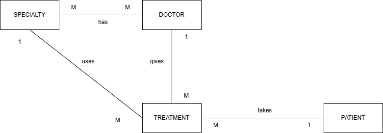

### Diagrama conceptuală
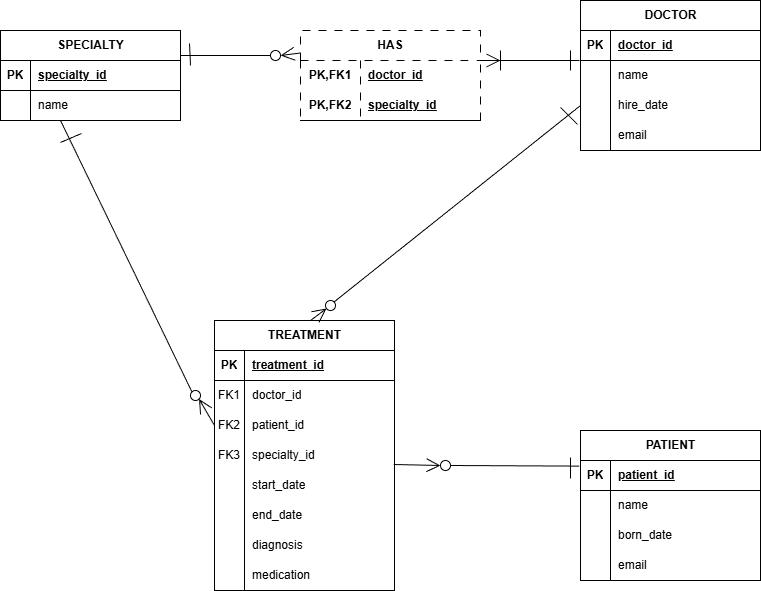

Modelul relațional este normalizat până la Forma Normală 3 (FN3). Atributele sunt atomice (FN1), fiecare atribut non-cheie depinde complet de cheia primară (FN2), nu doar de o parte, iar dependențele tranzitive sunt eliminate (FN3), adică fiecare atribut non-cheie depinde doar de cheia primară. Entitatea Treatment ar fi putut fi modelată ca un tabel asociativ rezultat dintr-o relație de tip 3, însă pentru simplitatea experimentului a fost tratată ca o entitate separată.

### Crearea și popularea bazei de date
Oracle Database 19c a fost instalată local folosind distribuția oficială:
https://www.oracle.com/database/technologies/oracle19c-windows-downloads.html

După instalarea Oracle Database și a clientului grafic Oracle SQL Developer, schema relațională este creată folosind scriptul SQL din fișierul create_dbs/relational_schema.sql. Datele sunt populate automat cu ajutorul unui script Python (create_dbs/populate_with_data.py), care generează date sintetice realiste (cu faker ([2](#ref2))) și le inserează în tabele prin intermediul bibliotecii oficiale oracledb([1](#ref1)).

Pașii urmați sunt următorii:
1. Conectarea ca administrator la baza de date și crearea utilizatorului dedicat aplicației:
```sql
-- Crearea utilizatorului dorit
CREATE USER db_an3 IDENTIFIED BY parola123;

-- Acordarea drepturilor necesare
GRANT CONNECT, RESOURCE, UNLIMITED TABLESPACE TO db_an3;
```
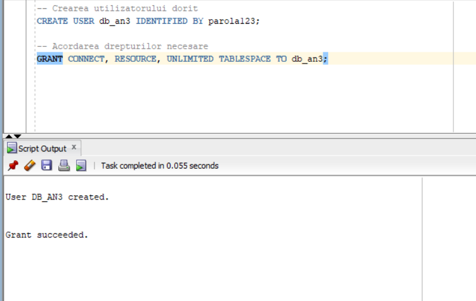

2. Crearea unei noi conexiuni în Oracle SQL Developer folosind utilizatorul definit anterior.
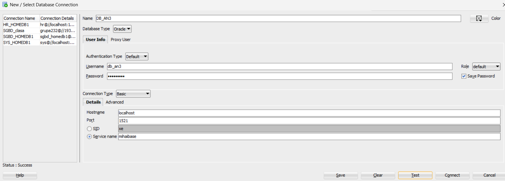

3. Rularea scriptului relational_schema.sql pentru crearea tabelelor și a constrângerilor de integritate.


4. Instalarea driverului Oracle și a bibliotecii faker pentru generarea datelor sintetice:  

```bash
pip install oracledb faker
```

5. Rularea scriptului populate_with_data.py pentru popularea bazei de date cu date sintetice.
Atenție: acest script este rulat o singură dată, MAI JOS, deoarece este utilizat ulterior și pentru popularea bazei de date MongoDB (celor 3), asigurând astfel consistența volumului și structurii datelor între cele două tipuri de SGBD-uri.


---

## Modelarea pentru MongoDB

Pentru componenta NoSQL, am optat pentru o arhitectură denormalizată([4](#ref4)), strategia inversă normalizării. Denormalizarea este o strategie de optimizare care reduce necesitatea operațiunilor de JOIN și complexitatea interogărilor, prin includerea (embedding) datelor direct în documentele părinte. Deși această abordare introduce redundanță și relaxează consistența strictă specifică modelului ACID, ea este potrivită pentru sisteme în care operațiile de citire sunt mult mai frecvente decât cele de scriere.

### Decizii de modelare

#### 1. Embedding (îmbricare)

Unele colecții și relații au fost eliminate prin îmbricare. Astfel, colecția `doctors` conține un array de specializări, iar colecția `patients` conține un array de tratamente.

Justificare: Într-un sistem medical, datele sunt accesate contextual. Profilul unui medic este, de regulă, consultat împreună cu specializările sale, iar fișa unui pacient împreună cu istoricul tratamentelor. O singură operațiune de citire (`find`) poate returna toate informațiile necesare.

#### 2. Extended Reference Pattern([6](#ref6)) și Subset Pattern([5](#ref5))

Ambele se folosesc pentru relații 1-to-many și many-to-many.

Subset Pattern apare ca o soluție atunci când avem date foarte multe care ar putea depăși capacitatea RAM-ului sau când dorim să optimizăm citirile. În cazul nostru, este mult mai eficient să avem două colecții separate (doctors și patients) și să includem în documentele pacienților doar o parte din informațiile despre doctori și doar specializarea corespunzătoare tratamentului respectiv, în loc să îmbricăm întregul document al doctorului, cu toate specializările sale, în fiecare tratament al pacientului.

Extended Reference Pattern ne spune că, în loc să copiem toate atributele unui document referit, putem copia doar o parte din ele, cele mai relevante pentru contextul în care sunt folosite. De asemenea, aceste atribute ar trebui să fie și cele care se schimbă cel mai rar, pentru a minimiza problemele de consistență a datelor și update-urile multiple.

Astfel, pentru a maximiza viteza de citire și ținând cont de cele două pattern-uri, am aplicat o denormalizare parțială. În lista de tratamente a pacientului, am inclus nu doar ID-urile de referință pentru doctor și specialitate (doctor_id, specialty_id), ci și duplicate ale numelor acestora (doctor_name, specialty_name).

Justificare: Această abordare permite afișarea completă a istoricului medical al unui pacient fără a interoga colecția `doctors`, menținând totodată posibilitatea de a corela datele cu entitățile sursă atunci când sunt necesare informații suplimentare.

#### 3. Gestionarea identificatorilor și a constrângerilor

Pentru a asigura trasabilitatea între baza de date relațională și MongoDB, cheile primare din SQL (`doctor_id`, `patient_id`) au fost mapate direct pe câmpul `_id` al documentelor MongoDB. Această abordare păstrează cerința MongoDB de identificator unic și facilitează corelarea datelor între cele două sisteme.

MongoDB nu oferă constrângeri de integritate referențială (Foreign Keys) la nivel de SGBD. Cu toate acestea, constrângeri de tipuri de date și de prezență a câmpurilor pot fi impuse prin mecanisme de validare JSON Schema. În cadrul acestui proiect, validarea relațiilor dintre documente este realizată la nivel de aplicație (scriptul de generare a datelor), pentru a evidenția diferențele față de modelul relațional.

### NoSQL Schema Diagram
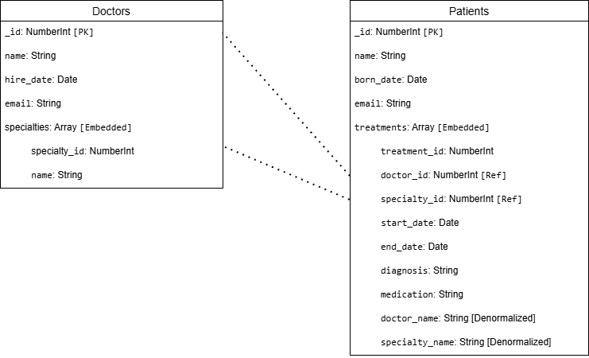

### Crearea și popularea bazei de date
Pentru a demonstra diferențele de performanță și arhitectură, folosim Docker pentru a rula trei instanțe diferite de MongoDB simultan([3](#ref3)):
a. Standalone: O instanță simplă (Port 27017).
b. Replica Set: Un cluster cu 3 noduri pentru disponibilitate ridicată (Primary pe Port 27027).
c. Sharded Cluster: O arhitectură scalabilă cu Router (mongos), Config Server și un Shard (Router pe Port 27067).

Pașii de configurare:
1. Instalarea Docker Desktop de aici https://docs.docker.com/desktop/  și pornirea containerelor folosind fișierul docker-compose.yml din rădăcina proiectului (după ce pornim Docker Desktop):

```bash
docker-compose up -d
```
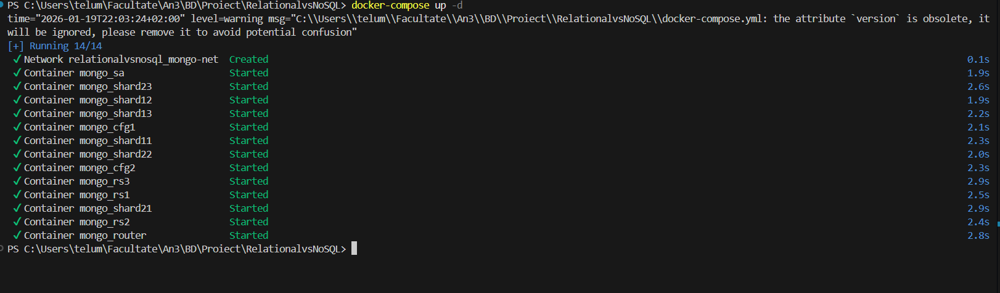

Cateva informatii despre .yml:
- Folosim versiunea 3.8 a Docker Compose, care suporta functionalitati avansate pentru definirea serviciilor.
- In services, sunt definite trei tipuri de baze MongoDB: standalone, replica set si sharded cluster, fiecare configurat cu porturile necesare.
- Nu folosesc volume mapping pentru persistenta datelor, deoarece scopul este testarea performantei și comportamentului in memorie. Astfel, datele sunt volatile și se pierd la oprirea containerelor.  
- Fiecare baza de date MongoDB este compusa dintr-unul sau mai multe containere (StandAlone: primul, ReplicaSet: urmatoarele trei, Sharded Cluster: restul). 
- Toate serviciile/containerele au un nume sugestiv extern (numele serviciului), au un nume sugestiv intern (numele din retea; DNS intern), folosesc imaginea oficiala MongoDB (mongo:latest) și comunică printr-o rețea Docker dedicată (mongo_net). 
- RepicaSet-ul are trei noduri: mongo-rs1 (primary), mongo-rs2 si mongo-rs3 (secondary), Sharded Cluster-ul are un config server cu 2 noduri (mongo-cfg1/2; in practică sunt cel putin 3), două shard-uri cu cate 3 noduri (mongo-shard11, mongo-shard12, mongo-shard13 și  mongo-shard21, mongo-shard22, mongo-shard23) și un router (mongo-router).
- In "command" suprascriem comanda implicita de start a imaginii MongoDB pentru a specifica parametrii necesari fiecarei configuratii.
La STANDALONE nu apare, căci se folosește configuratia implicită. 
La REPLICA SET, pentru fiecare conatiner, specificam că: este parte dintr-un replica set prin "--replSet", numele replicaset-ului ("rs0"), faptul că va accepta conexiuni de oriunde prin "--bind_ip_all", dar și faptul că procesul porneste pe portul intern 27017 al conatinerului, specific pentru MongoDB ("--port", "27017").
La SHARDED CLUSTER avem mai multe tipuri de containere: config server ("--configsvr"), shard ("--shardsvr") si router ("mongos"). Fiecare tip are parametrii specifici. Serviciile mongo-cfg (cele cu eticheta "--configsvr") fac parte dintr-un replica set dedicat ("--replSet", "cfgrs") pentru stocarea metadatelor cluster-ului, constituind conceptul de **config server**, mongo-shard1x, mongo-shard2x (cele cu eticheta"--shardsvr") fac parte din replica set-uri ("--replSet", "shard1rs"; "--replSet", "shard2rs") pentru stocarea datelor efective,  constituind conceptul de **shard-uri**, iar serviciul mongo-router ("mongos") este punctul de acces pentru aplicații, care directionează cererile către shard-uri, el reprezentand conceptul de **router**. Toate aceste containere (servicii din conatinere) sunt configurate să accepte conexiuni de oriunde prin "--bind_ip_all" si toate procesele MongoDB (din containere) rulează pe portul intern 27017. 
- Prin comanda "--configdb cfgrs/mongo-cfg1:27017,mongo-cfg2:27017", router-ul se conectează la config server-ul care rulează pe portul 27017 și este definit de replica set-ul "cfgrs", pentru a obtine informațiile despre cluster și a direcționa cererile către shard-uri.
- Secțiunea "depends_on:" de la router asigură că acesta pornește doar după ce config server-ul și ambele shard-uri sunt functionale.
- Nu mapăm porturi pentru toate containerele (prin "- ports: port_extern_PC:port_intern_Container" ), caci nu avem nevoie să sțim portul extern (de pe laptop) pentru toate, deoarece nu le accesăm pe toate din exterior, ci doar pentru primary-uri din replicaSet-uri, respectiv pentru router-ul. 
- Primary-urile (din Replica Set) nu sunt alese acum, ci ulterior, în scriptul de inițializare în funcție de server-ul pe care alegem să rulăm comanda de inițializare. La shrded cluster, prymary-urile sunt alese automat de MongoDB în funcție de configurația replica set-urilor.
- Dacă pentru router suntem obligați să scriem explicit **mongos** la începutul listei de comenzi, pentru celelalte containere nu este necesar, deoarece imaginea oficiala MongoDB pornește implicit procesul **mongod** (Mongo Daemon) la start.
- Mai multe despre replica set-uri și sharded cluster vom pomeni la sectiunea ACID vs CAP.

2. Inițializarea Arhitecturilor: Deoarece containerele pornesc "goale", trebuie să rulăm scriptul de configurare pentru a activa Replica Set-ul și Clusterul Sharded. Se rulează scriptul init_mongo.bat (sau comenzile echivalente în terminal).
```bash
create_dbs/init_mongo.bat
```
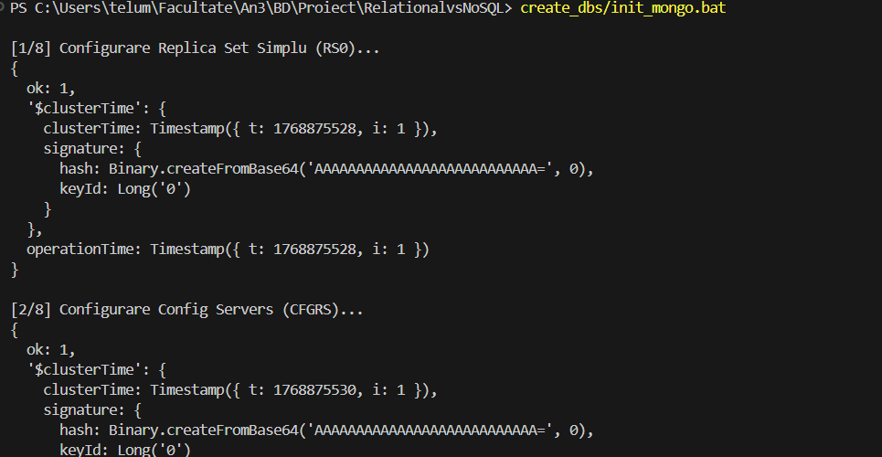

Câteva informații despre script:
- Scriptul init_mongo.bat configurează cele trei tipuri de baze MongoDB: Standalone, Replica Set si Sharded Cluster.
- Pentru Standalone, nu este necesară nicio configurare suplimentară, deoarece acesta rulează implicit ca o instanță simplă.
- Pentru Replica Set, scriptul se conectează la nodul primar (mongo-rs1) și rulează comanda rs.initiate() pentru a inițializa replica set-ul "rs0" și a adăuga celelalte noduri (mongo-rs2 și mongo-rs3) ca secundare.
- Pentru Sharded Cluster, scriptul se conectează la router (mongo-router) și rulează comenzile necesare pentru a adăuga config server-ele și shard-urile la cluster. De asemenea, setează regulile de sharding pentru baza de date "db_an3", inclusiv setarea dimensiunii chunk-urilor (1MB, de la default 64, pentru a observa sharding-ul) și activarea sharding-ului pe colectia "patients". 
- Shard key-ul ales este _id, cu indexare hashed, pentru a asigura o distribuție uniformă a datelor între shard-uri, chiar dacă se va pierde puțin din performanța interogărilor range queries.
- **Am folosit Gemini pentru a crea comanda de modificare a dimensiunii chunk-urilor și pentru a seta regulile de sharding corect.**

3. Instalarea bibliotecii pymongo pentru interacțiunea cu Python:
```bash
pip install pymongo
```
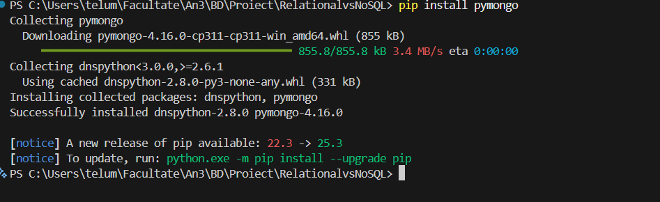

4. Popularea Unificată - Rularea scriptului populate_with_data.py: 
```bash
python create_dbs/populate_with_data.py
```


Câteva informații despre script:
- Scriptul populate_with_data.py populează toate cele trei instanțe MongoDB (Standalone, Replica Set și Sharded Cluster) cu același set de date utilizat pentru Oracle Database, generate cu ajutorul bibliotecii Faker si care difera de la generare la generare.
- Scriptul curată mai întâi colecțiile existente în fiecare instanță pentru a evita duplicarea datelor si apoi inserează documentele generate în colecțiile corespunzătoare.
- Curățarea colecțiilor se face prin apeluri la metoda delete_many({}) pentru fiecare colecție din fiecare instanță MongoDB, asigurându-se că datele vechi sunt eliminate înainte de inserarea noilor date, dar nu dispare configurația de sharding. Pentru Oracle, tabelele sunt golite prin comenzi de DELETE.

5. Oprirea containerelor după terminarea testelor:
```bash
docker-compose down
```


---

## Dashboard pentru distribuție, modelare și arhitectură a datelor
Pentru a vizualiza și compara modelele de date relaționale și NoSQL, am creat un dashboard interactiv folosind Streamlit, folosind **Gemini**, dar și **cursul despre replicare și sharding**. Acesta permite explorarea diagramelor, a deciziilor de modelare și a arhitecturii alese pentru fiecare tip de bază de date.

Pasii pentru rularea dashboard-ului:
1. Instalarea streamlit, pandas (pentru tabele) și plotly (pentru grafice plăcute):
```bash
pip install streamlit pandas plotly
```
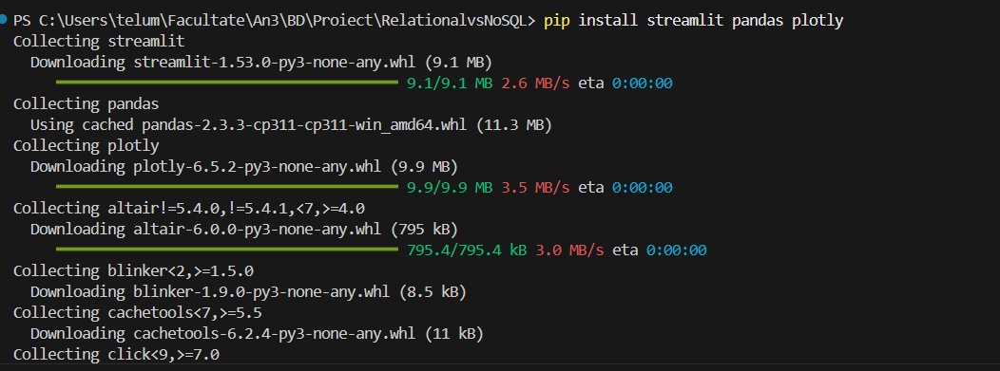

2. Rularea aplicației Streamlit folosind fișierul dashboard.py din folderul dashboards:
```bash
streamlit run dashboards/dashboard1.py
```
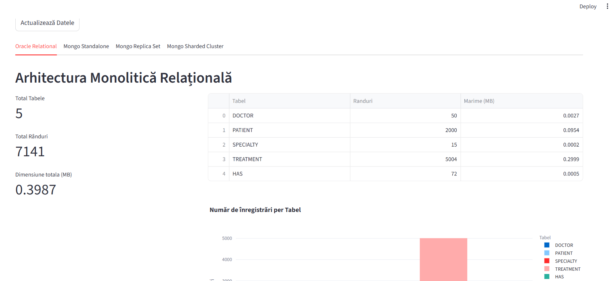

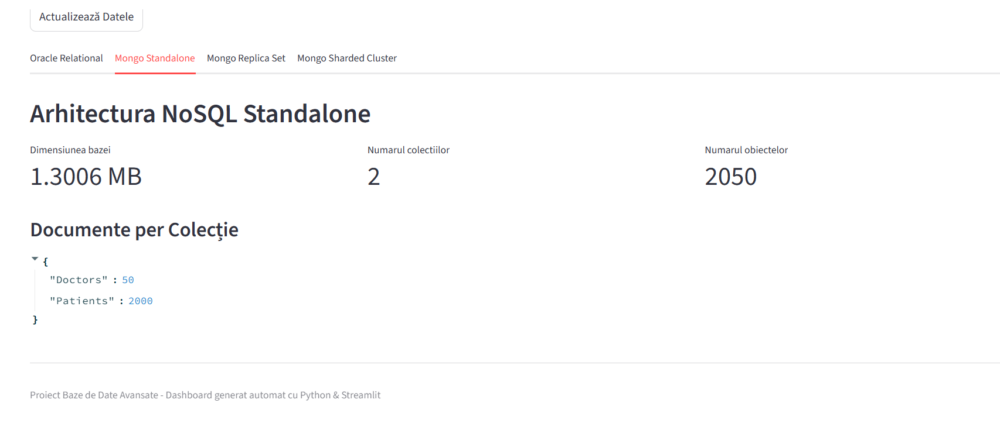

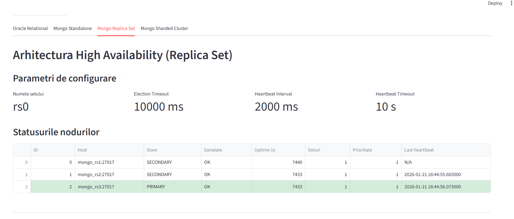

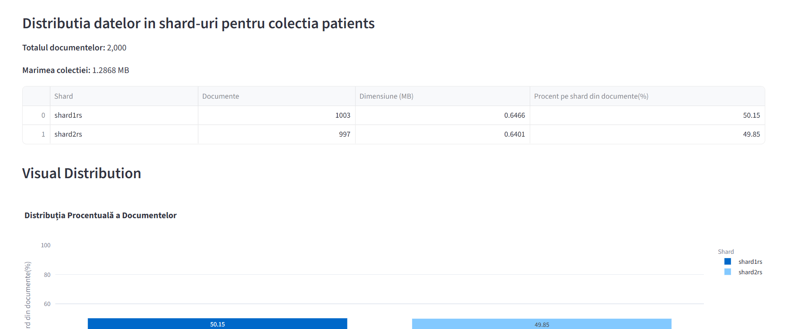


---
## Diferențe cheie de modelare și arhitectură între SQL și NoSQL (Oracle vs MongoDB)

| Aspect | Oracle Database (Relațional) | MongoDB (NoSQL) |
|------|-----------------------------|-----------------|
| Model de date | Tabular (tabele, rânduri, coloane) | Documente BSON (JSON-like) |
| Schema | Fixă, impusă strict de BD | Flexibilă (schema-less la nivel de engine) |
| Tipuri de date | Strict definite | Slab tipizate (implicit) |
| Chei primare | Obligatorii | Opționale (se pune automat _id, dacă nu se precizează) |
| Chei externe | Suportate nativ (FOREIGN KEY) | Nesuportate nativ |
| Integritate referențială | Garantată de BD | Gestionată la nivel de aplicație (scriptul de insert) |
| Normalizare | Puternic normalizat | De obicei denormalizat |
| Relații între entități | JOIN-uri eficiente | Referințe manuale sau documente embed |
| Scalabilitate | Verticală (scale-up) | Orizontală (scale-out) |
| Replicare | Nativă (Data Guard, RAC) | Nativă (Replica Set) |
| Sharding | Nu este nativ | Nativ |
| Performanță citire | Bună, cu cost JOIN | Foarte bună (document complet) |
| Overhead de stocare | Redus | Mai mare (BSON + metadata) |
| Volum datelor stocate (pentru același set de date inserate) | Date compacte, fără duplicate, fără nume de coloane repetate. Aprox. 0.4MB pentru datele de test | Foarte mare. Date denormalizate (duplicate), cu numele cheilor repetate în fiecare document. |
| Evoluția structurii | Costisitoare (ALTER TABLE) | Foarte ușoară (pur și simplu inserezi documente cu un câmp nou/fără un anumit câmp) |


---

## Referințe

<a id="ref1"></a>
[1] Oracle, python-oracledb Documentation,
https://python-oracledb.readthedocs.io/en/latest/index.html
Last accessed: January 13, 2026

<a id="ref2"></a>
[2] Faker Contributors, Faker – Fake Data Generator for Python,
https://faker.readthedocs.io/en/master/
Last accessed: January 15, 2026

<a id="ref3"></a>
[3] Harsh Patel, The Secret to Scaling Your Database: MongoDB’s Replication and Sharding Explained,
https://medium.com/@code.by.hp/the-secret-to-scaling-your-database-mongodbs-replication-and-sharding-explained-e677f4099480
Last accessed: January 11, 2026

<a id="ref4"></a>
[4] GeeksforGeeks, Denormalization of Data in MongoDB,
https://www.geeksforgeeks.org/mongodb/denormalization-of-data-in-mongodb/
Last accessed: January 14, 2026

<a id="ref5"></a>
[5] Daniel Coupal, Ken W. Alger, Building with Patterns: The Subset Pattern,
https://www.mongodb.com/company/blog/building-with-patterns-the-subset-pattern
Last accessed: January 10, 2026

<a id="ref6"></a>
[6] Daniel Coupal, Ken W. Alger, Building with Patterns: The Extended Reference Pattern,
https://www.mongodb.com/company/blog/building-with-patterns-the-extended-reference-pattern
Last accessed: January 16, 2026


